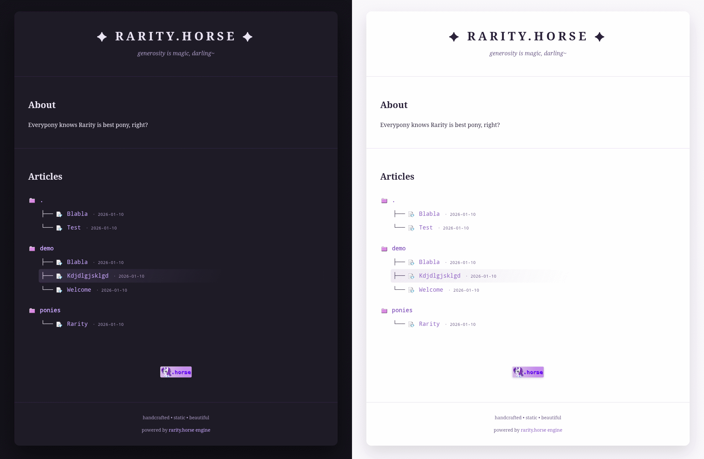
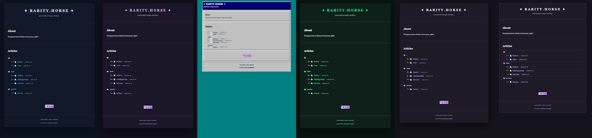

# <p align="center">✦  Rarity.Horse Engine ✦</p>

[](https://github.com/violinmelody/rarity.horse/actions/workflows/build.yml)
[](https://rarity.horse/)

<p align="center">
A handcrafted, static, markdown-driven blog website engine inspired by  
90s personal pages, demoscene aesthetics and Rarity's elegance.
</p>
<p align="center">
Create your blog in seconds using favourite text editor directly from your computer.
</p>
<p align="center">
See the live demo on https://rarity.horse/
</p>

# <p align="center"></p>

- No JavaScript
- No trackers
- No runtime dependencies
- Built automatically with GitHub Actions
- Can be served via GitHub Pages

---

## Features

- Markdown articles that can be also stored in a **separate repository**
- Automatic article dates (from file modification time)
- Folder-based categories
- Per-article image folders
- ASCII tree index
- Automatic dark/light mode
- Beautiful yet extremely fast (pure HTML + CSS)
- Support for custom themes

# <p align="center"></p>

---

## Repository Model

This project is intentionally split into **two repositories**:

### 1. Engine Repository (this repo)
- Public
- Contains:
  - Static site generator
  - HTML templates
  - CSS themes and icons
  - GitHub Actions workflow

### 2. Content Repository
- Separate repository
- Can be **private**
- Contains:
  - Markdown articles
  - Images
  - Site setup (title, motd, about & buttons sections)
  - Dispatch job

The engine **consumes content at build time** via GitHub Actions.  
Content is never committed to this repository.

---

## Content Repository Structure

The content repository must expose the following structure:

```text
content/
├─ articles/
│  └─ category/
│     ├─ article.md
│     └─ article/
│        └─ image.png
│
└─ meta/
   ├─ title.md
   ├─ motd.md
   ├─ about.md
   ├─ footer.md
   ├─ theme.md
   ├─ buttons.md
   └─ buttons/
      ├─ button1.png
      ├─ button2.png
      └─ button3.png
```

### Articles Content Rules

| Element | Meaning |
|-------|--------|
| Folder name | Category |
| Markdown filename | Article title |
| File modification time | Article date |
| Matching folder | Images for that article |

### Meta Content Rules

| Element | Meaning |
|-------|--------|
| buttons.md | Buttons section on the home page |
| buttons | Buttons images |
| theme.md | Site CSS theme, see theme folder for available options |
| footer.md | Footer section on the site |
| about.md | About section on the home page |
| motd.md | Site message under the title |
| title.md | Site title |

By editing these meta files you are able to change site title, its CSS (theme), write full 'about' section, motd (text under the title) or even edit list of buttons visible under the list of articles.
Please note `title.md`, `motd.md` and `theme.md` should not contain actual Markdown but just plain text.

---

## Writing Articles

### Create a new article

```bash
mkdir content/articles/rarity
nano content/articles/rarity/she_is_beautiful.md
```

### Add images

```bash
mkdir content/articles/rarity/she_is_beautiful
cp image.png content/articles/rarity/she_is_beautiful/
```

### Reference images in Markdown

```md

```

---

## Engine Repository Structure

```text
.
├─ build/            # Static site generator (Python)
├─ templates/        # HTML templates
├─ theme/            # CSS + icons
├─ example-content/  # Demo content for forks
├─ wwwroot/          # GENERATED output (CI only)
└─ .github/          # GitHub Actions
```

> `wwwroot/` is generated and must never be edited manually.

---

## Configuring the Content Repository (GitHub Actions)

The engine repository’s GitHub Actions workflow checks out **two repositories**.

### Required workflow step

```yaml
- name: Checkout content
  uses: actions/checkout@v4
  with:
    repository: YOUR_USERNAME/YOUR_CONTENT_REPO
    path: content
    token: ${{ secrets.CONTENT_REPO_TOKEN }}
```

### Required secret

Create a **GitHub token** with:

- Repository access: *content repository only*
- Permission: `Contents: Read`

Add it to the engine repository as:

```
Settings → Secrets → Actions
Name: CONTENT_REPO_TOKEN
```

This allows CI to read private articles without exposing them.

---

## Local Development

Install dependencies:

```bash
pip install markdown
```

Build the site:

```bash
python build/build.py
```

Output will be written to:

```text
wwwroot/
```

For local testing, you may manually place a `content/` directory at the project root.

---

## Deployment

This engine can automatically rebuild whenever the **private content repository** is updated.  

### How it works

1. **Private content repo workflow** triggers on every push to `main`.  
   It sends a `repository_dispatch` event to the engine repo.
2. **Engine repo workflow** listens for this event.  
   It checks out:
   - The engine repository
   - The private content repository
3. The engine builds the site and deploys it to GitHub Pages automatically.

### Setup Steps

#### 1. Create a Personal Access Token (PAT)

- Go to your GitHub **Settings → Developer settings → Personal access tokens → Fine-grained tokens**.
- Scope: **Engine repo only**
- Permissions: `Contents: Write`, `Workflows: Trigger`
- Add this PAT to the **content repo** as `RARITY_ENGINE_REPO_PAT`.

#### 2. Add a Token for Content Repo in Engine Repo

- Create a token in GitHub with **read access** to the content repo.
- Add it to **engine repo secrets** as `RARITY_CONTENT_REPO_TOKEN`.

#### 3. Add the Workflows

- Content repo workflow triggers the engine build
- Engine repo workflow handles the dispatch event and builds the site

#### 4. Enable GitHub Pages

- Repository → Settings → Pages
- Source: **GitHub Actions**

---

## Forking This Repository

When forked:

- No content is included
- `example-content/` shows the expected structure
- You must provide your own content repository or local `content/` directory

---

## License

💎 [Do whatever you want, just keep it elegant](https://github.com/violinmelody/rarity.horse/blob/main/LICENSE) 💎

